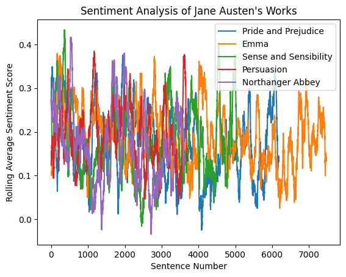

# Text Generating Recurrent Neural Network

## Key Terms and Concepts
To better understand the concepts involved in this project, it's important to familiarize ourselves with some key terms and metrics:

* **NLP**
    * NLP is a subfield of artificial intelligence that focuses on the interaction between computers and humans through natural language. The ultimate objective of NLP is to read, decipher, understand, and make sense of the human language in a valuable way. It's akin to teaching a computer to understand and communicate in human language. Applications of NLP are everywhere in our daily lives, from voice assistants and email filters to language translation apps. I wanted to create a model to generate text in the style of various authors is fundamentally an NLP task. It involves teaching our model to understand the unique styles of different authors and generate new text that maintains these stylistic nuances.

* **Recurrent Neural Network (RNN)**
    * Think of an RNN like a detective reading a novel, trying to solve a mystery. The detective needs to remember previous events in the story to understand the context and make predictions about the plot. Similarly, an RNN processes sequences of data (like sentences in a text) and uses its internal memory to remember past information, which it uses to influence future outputs. This memory enables RNNs to understand the context and meaning of a sequence, making them ideal for tasks like language translation or speech recognition.
        * These networks excel at processing sequential data by maintaining an internal memory. They can capture patterns and dependencies in sequences, making them useful for tasks like natural language processing and time series analysis. RNNs have connections that form cycles, allowing information to persist and influence future outputs.
    * New technologies like transformers have largely replaced RNNs in many NLP tasks, but they are still useful for many applications.

* **Long-Short-Term Memory Networks (LSTMs)**
    * If an RNN is a detective, then an LSTM is a detective with a sophisticated notebook. In a complex mystery novel, a detective needs to remember clues from early in the story that might be relevant later on. But not all details are important. So the detective writes down crucial information in a notebook, updates it as the plot progresses, and refers back to it when necessary. Similarly, LSTMs have a mechanism (the cell state) that acts like this notebook, carrying important information throughout the sequence. They also have "gates" that decide what information gets written in, erased, or read from the notebook at each step in the sequence. This makes LSTMs excellent at tasks that require understanding long-term dependencies, like text generation or machine translation

* **Gates**
    * Gates in an LSTM are like the detective's decision-making rules for managing the notebook. There are 3 ‘rules’ (gates) that the LSTM utilizes:
        * <u>Input Gate</u>: The "input gate" decides which new clues from the current scene should be written down. 
        * <u>Forget Gate</u>: The "forget gate" decides which old clues are no longer relevant and should be erased. 
        * <u>Output Gate</u>: The "output gate" decides which clues are important for solving the current scene and should be read and considered. These gates help the LSTM keep the most relevant information in its "notebook" and forget the irrelevant details, enabling it to efficiently understand long-term dependencies in the data.

* **Cell State**
    * The cell state in an LSTM is like the detective's notebook. It carries the important clues or context from earlier scenes to later ones, enabling the detective (or the LSTM) to remember important details over a long period. It's like a conveyor belt that runs through the entire story, carrying only the important clues that the detective decides to keep.

* **Hidden State**
    * The hidden state is like the detective's current line of thought or short-term memory. It carries information from one scene (step in the sequence) to the next and is used to make the current prediction or decision. It's derived from the current notebook entries but is influenced by the detective's current focus (the output gate), meaning it only carries a portion of the information in the notebook.

* **Transformer Models**
    * Transformer models represent the cutting edge in Natural Language Processing. Imagine a super-intelligent translator that not only translates a sentence from one language to another but also understands and considers the context of the entire conversation. That's what a Transformer model does when processing text. Unlike RNNs and LSTMs, which process text sequentially, Transformers read the entire sequence of words at once, making them more aware of all the words and their context at the same time. This ability to handle long-term dependencies and maintain context over longer sequences makes them the best available tool for many NLP tasks, from text generation to translation to sentiment analysis.

## Methodology

The first step in our process was an in-depth analysis of the text of each author. This involved performing a sentiment analysis and a sentence length analysis.

Sentiment analysis, as shown in Figure 1, provides insights into the emotional tone throughout Jane Austen's books. Understanding the sentiment of the text is critical when developing a text generation model. The sentiment embedded in the author's writing style can influence the choice of words, phrases, and overall narrative arc. By capturing this sentiment in our model, we can generate text that not only mimics the vocabulary and grammar of Jane Austen, but also resonates with the same emotional tone that pervades her works.

